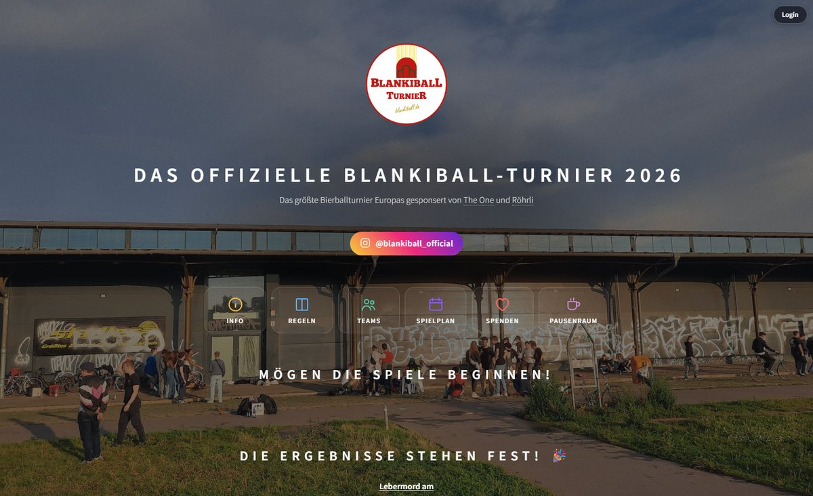
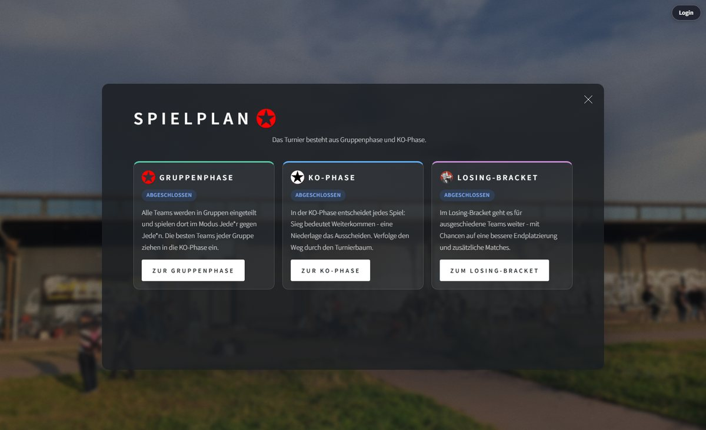
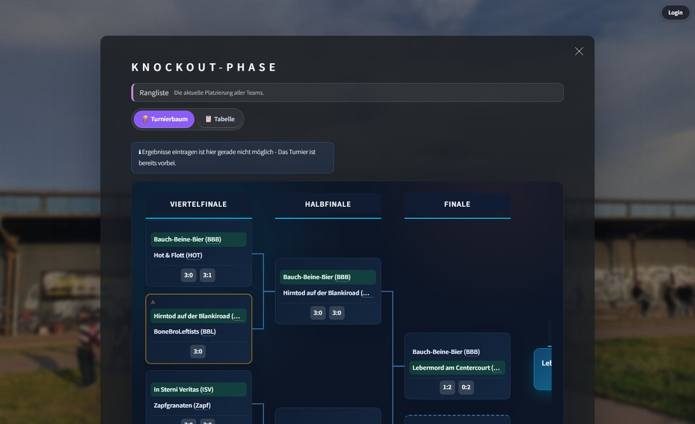
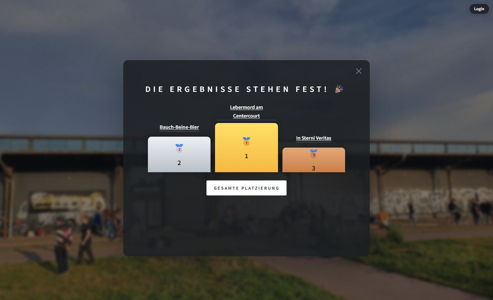
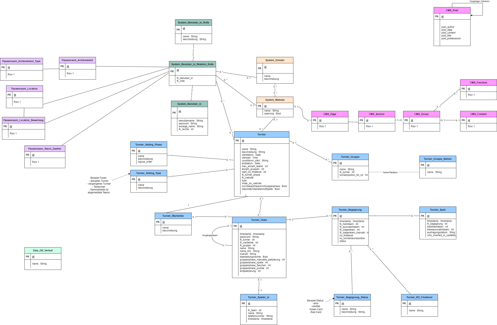

# Tournament Website

A full-featured web platform for organizing and running recurring sports tournaments —
from team registration and the group draw through the knockout bracket to the final
standings. It is used in production for the annual **Blankiball** tournament
([blankiball.de](https://blankiball.de)) and ships with its own **content management system**,
so organizers can maintain the entire website without touching code.

The platform is not tied to a single event: tournaments, teams, matches and page content
all live in the database, and the same codebase serves the current tournament, past
tournaments (history) and sandboxed test tournaments.




| Schedule overview | Knockout bracket | Podium |
| --- | --- | --- |
|  |  |  |

---

## Highlights

**Tournament engine**
- Configurable tournament phases (registration, group stage, knockout stage, finished)
- Randomized group draw, group tables with automatic ranking
- Automatically generated knockout bracket, including a losing bracket and placement matches
- Match scheduling, result entry by teams or referees, special cases such as "green card" matches
- Podium and final rankings, full history of all past tournaments

**For teams and visitors**
- Self-service team registration with waiting list and captcha protection
- Team area for managing players and entering results
- Live schedule, standings and interactive bracket view (touch and drag-to-scroll)
- Printable participation certificates generated as PDF
- Installable on the home screen of mobile devices

**For organizers ("Backstage")**
- Central user management with a role-based permission model
  (Admin, Co-Admin, Tournament Master, Referee, Author, Backstage read access, …)
- Tournament settings, team management and phase control in the browser
- Test mode: run a complete sandbox tournament alongside the live event
- Visitor and usage analytics, database change history

**Operations**
- Automated database backups with a tiered retention policy (hourly → yearly)
- Multi-domain support: one installation serves several websites, resolved by domain/subdomain
- Continuous deployment to the production server via GitHub Actions

---

## Content Management System

The public pages are not hard-coded — they are assembled from content blocks stored in the
database and can be edited directly on the live page by users with the *Author* role (or higher).

**Content model.** Content is organized hierarchically:
`Website → Page → Section → Group → Content block`. Each level is a MySQL table, and ordering
within a group is maintained by the CMS, so blocks can be inserted, moved and removed freely.

**Two kinds of blocks.**
- *Text blocks* hold HTML content plus a style tag (heading, paragraph, list, highlight, …).
- *Function blocks* reference a registered render function (e.g. bracket, schedule, team list,
  standings). This lets editors place live tournament data anywhere between editorial content,
  without developer involvement.

**Inline editing.** When a user with CMS permission is logged in, the page switches into an edit
mode: every block gets a toolbar to edit, move up/down, insert a new block or delete it. Changes
are visible immediately on the live page.

**Security.** CMS access is bound to the central role model; all modifying forms are protected by
CSRF tokens and use prepared statements on the database side.

*Technologies:* PHP (server-side rendering), MySQL/MariaDB (relational content model),
HTML/CSS/JavaScript (edit toolbar and forms).

---

## Data Model

The relational schema covers the tournament domain (tournaments, groups, teams, players, matches,
games), the user and role system, multi-domain configuration and the CMS.



---

## Tech Stack

| Area | Technology |
| --- | --- |
| Backend | PHP 8, server-side rendering, sessions with role-based access control |
| Database | MySQL / MariaDB (mysqli, prepared statements) |
| Frontend | HTML5, CSS/Sass, JavaScript, jQuery |
| PDF generation | FPDF (participation certificates) |
| Security | CSRF tokens, hCaptcha plus a custom image captcha, output escaping |
| Mail | Pluggable mail transport (SMTP or SendGrid API) |
| Deployment | GitHub Actions (automatic deployment on push), Apache |

## Project Structure

```
index.php                   Entry point: routing between sections, page rendering
database/                   DB connection, role definitions, backups, analytics
website_print_functions/    Rendering: CMS, tables, bracket, schedule, forms
website_datachange/         Form handlers: content, teams, games, accounts, settings
website_functionalities/    Sessions, CSRF, captcha, mail, PDF certificates, vCard
assets/                     Stylesheets, JavaScript, fonts, audio
images/                     Logos, gallery, backgrounds
local_secrets/              Templates for local credentials (not versioned)
```

## Getting Started

**Requirements:** PHP 8.x with `mysqli`, MySQL or MariaDB, a web server (Apache recommended;
any local PHP stack such as XAMPP or EasyPHP works for development).

1. Clone the repository into the web server's document root.
2. Copy the credential templates and fill in your values:
   ```bash
   cp local_secrets/db_connection.example.php local_secrets/db_connection.local.php
   cp local_secrets/hcaptcha.example.php     local_secrets/hcaptcha.local.php
   ```
3. Create the database and point the configuration to it.
4. Open `index.php` in the browser.

Credentials are never committed — `local_secrets/*.local.php` is excluded via `.gitignore`.
More details on the server setup can be found in [SETUP.md](SETUP.md).

## Contributors

Developed and maintained by [Richard Bendler](https://github.com/richardbendler) within the
[MyTournament](https://github.com/MyTournament) organization, with contributions from
[Jonas Strube](https://github.com/jonasstrube) and [yesoer](https://github.com/yesoer).
